# Jarkom_Modul1_Lapres_B09
## Soal 1
Filter expression :
- http.host == "testing.mekanis.me"

Server: 
- nginx/1.14.0 (Ubuntu)

Screenshot :  

Penjelasan :
- Gunakan filter yang diberikan untuk mencari web server dari "testing.mekanis.me"

## Soal 2
Filter expression :
- Menggunakan text filter pada Export Object HTTP 
“Tim_Kunjungan_Kerja_BAKN_DPR_RI_ke_Sukabumi141436.jpg”

Screenshot :  
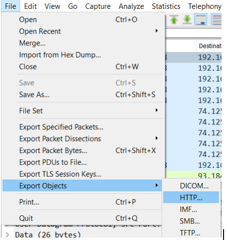
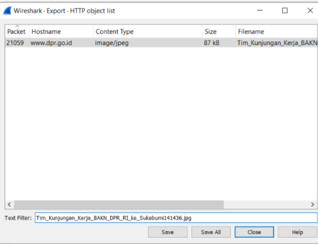
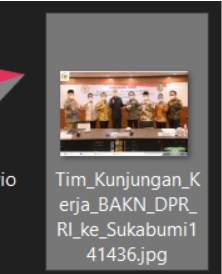
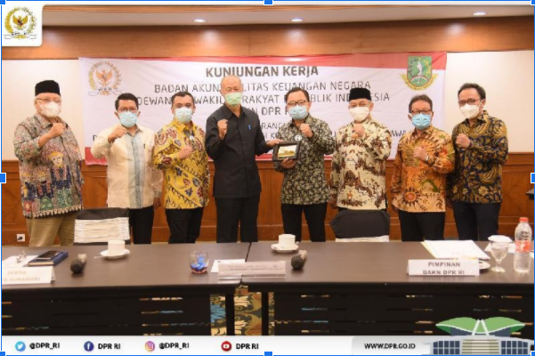

Penjelasan :
- Pada menu file kita lalu ke export object HTTP lalu cari dengan “Tim_Kunjungan_Kerja_BAKN_DPR_RI_ke_Sukabumi141436.jpg”

## Soal 3
Filter expression :
- http.host contains "ppid.dpr.go.id" and  http.request.method == "POST"
- username=10pemuda&password=guncangdunia

Screenshot :  
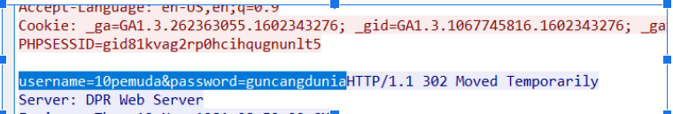

Penjelasan :
- Gunakan filter untuk mencari web dan dengan request POST kita menemukan username dan password pengguna

## Soal 4
Filter expression :
- http.authbasic

Nama-nama web yang menggunakan basic authentication adalah :
- testing.mekanis.me
- aku.pengen.pw

Screenshot :  
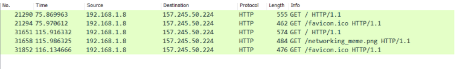

Penjelasan :
- Gunakan filter untuk mencari web yang menggunakan basic authentication
- Lalu cari web yang menggunakan basic authentication

## Soal 5
Filter expression :
- http.host == "aku.pengen.pw" && http.authorization

Nama-nama web yang menggunakan basic authentication adalah :
- testing.mekanis.me
- aku.pengen.pw

Screenshot :  
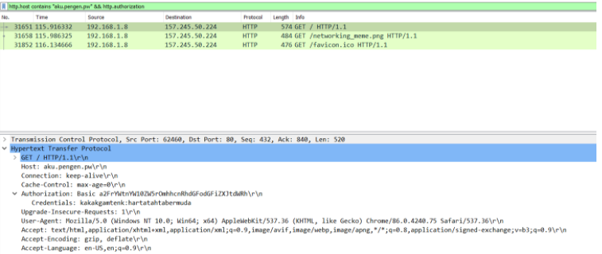
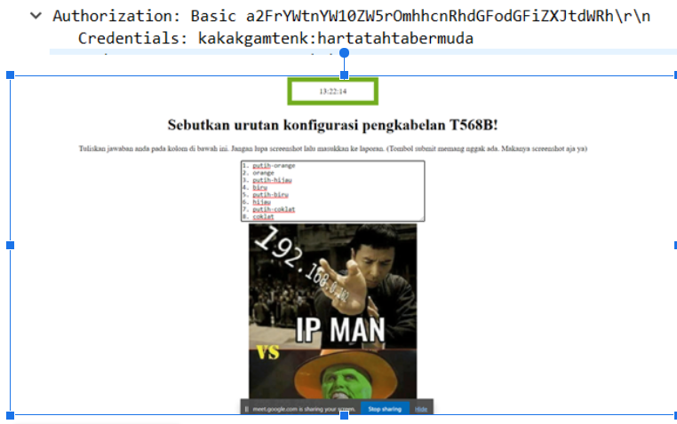

Penjelasan :
- Gunakan filter untuk mencari web dimana web tersebut berisikan data username dan password dari web 
- Lalu cari keunjungi web dan isi dengan username dan password daro file pcapng
- Lalu isi pertanyaan yang diberikan

## Soal 6
Filter expression :
- ftp-data.command contains Answer.zip
- ftp-data.command contains zipkey.txt

Screenshot :  

Penjelasan :
- Gunakan filter 1 untuk mencari packet data file Answer.zip lalu extract file zipnya dengan cara Follow TCP Stream lalu save as sebagai raw.
- Gunakan filter 2 untuk mencari packet data file zipkey.txt lalu Follow TCP Stream, terlihat passwordnya
- Buka file Answer.zip  

## Soal 7
Filter expression : search hex value 59 65 73 2e 70 64 66

Screenshot :  

Penjelasan :  
- Hex value tersebut merupakan string Yes.pdf yang dikonversikan menjadi bentuk Hex
- Extract packet yang ditemukan

## Soal 8
Filter expression :
- ftp contains Microsoft
- ftp.request.command == RETR && ip.host == 198.246.117.106

Screenshot :  

Penjelasan :
- Gunakan filter 1 untuk mencari ip Microsoft
- Gunakan ip sebagai filter untuk mencari objek didownload dari Microsoft
- Objek yang didownload adalah "Readme"

## Soal 9
Filter expression :
- ftp.request.command == USER or ftp.request.command == PASS

Screenshot :  
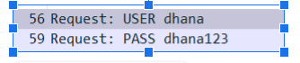

Penjelasan :
- Gunakan filter yang diberikan untuk mencari wusername dan password FTP localhost

## Soal 10
Filter expression :
- Search hex value 25 50 44 46, didapat dari clue soal. Follow TCP Stream frame 290. Simpan sebagai raw dan dinamai dengan format .pdf

Screenshot :  
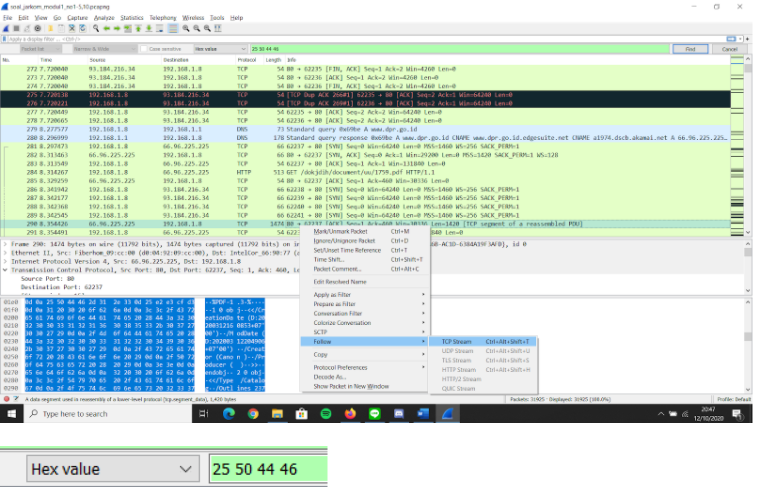

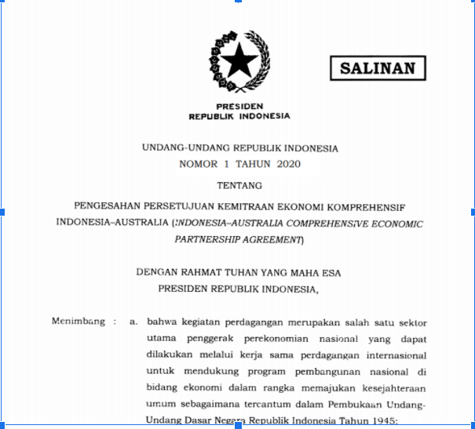

Penjelasan :
- Pertama kita mencari clue diberikan dengan mencarinya di search dengan memasukkan kode hex value yang diberikan
- Lalu kita buka dengan menggunakan follow lalu kita download versi rawnya lalu download dalam bentuk pdf

## Soal 11
Filter expression : port 21

Screenshot :  

Penjelasan :
- Packet yang muncul hanya paket yang mengandung port 21

## Soal 12
Filter expression : src port 80

Screenshot :  

Penjelasan :
- Packet yang muncul hanya paket yang berasal dari port 80

## Soal 13
Filter expression : dst port 443

Screenshot :  

Penjelasan :  
- Packet yang muncul hanya paket yang menuju port 443

## Soal 14
Filter expression : src host 192.168.100.25

Screenshot :  

Penjelasan :  
- Packet yang muncul hanya paket yang berasal dari ip sendiri

## Soal 15
Filter expression : dst host monta.if.its.ac.id

Screenshot :  

Penjelasan :  
- Packet yang muncul hanya paket yang tujuannya ke monta.if.its.ac.id
